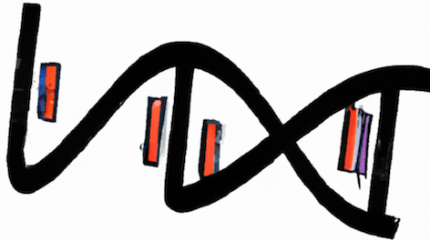
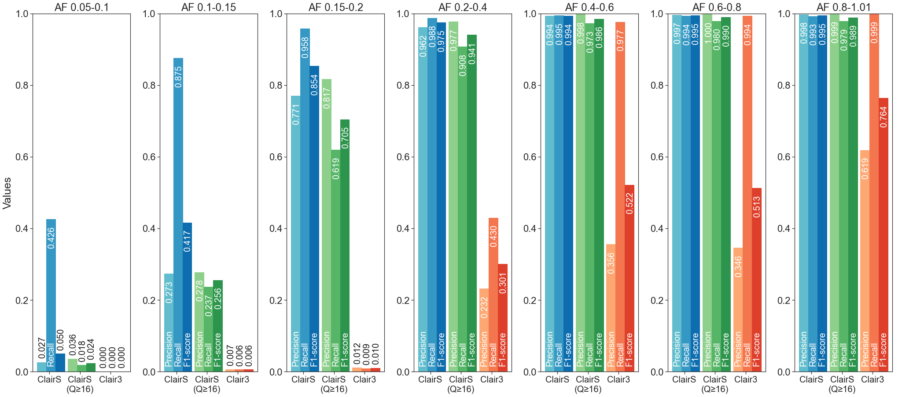
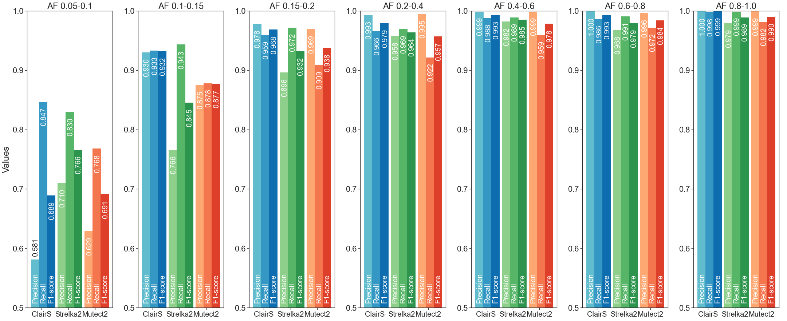

<div align="center">
    
</div>

# ClairS

[](https://opensource.org/licenses/BSD-3-Clause)

Contact: Ruibang Luo, Zhenxian Zheng  
Email: rbluo@cs.hku.hk, zxzheng@cs.hku.hk  

------

## Introduction

ClairS is a somatic variant caller designed for paired samples and primarily ONT long-read. It uses Clair3 to eliminate germline variants. It ensembles the pileup and full-alignment models in Clair3, trusts them equally, and decides on the result using a set of rules and post-processing filters. With 70-fold HCC1395 (tumor) and 45-fold HCC1395BL (normal) of ONT R10.4.1 data, benchmarking against the truth SNVs (Fang et al., 2021) has shown ClairS achieved 91.10% precision and 71.92% recall. Specifically, ClairS achieved 98.12% precision, 99.15% recall on variants with AF≥0.20, and 94.26% precision, 87.46% recall on variants with AF≥0.05. Detailed performance figures are shown below.

ClairS means Clair-Somatic, or the masculine plural of "Clair" in french (thus, 's' is silent).

The logo of ClairS was generated using DALL-E 2 with prompt "A DNA sequence with genetic variant that looks like a letter 'S'".

ClairS is now available for early access to interested and experienced users. Your suggestions and comments are highly appreciated.

------

## Performance figures

### ONT Q20+ chemistry SNV performance

* 70-fold HCC1395 (tumor) and 45-fold HCC1395BL (normal) of ONT R10.4.1 data
* Truth: 31,444 high confidence (HighConf) and medium confidence (MedConf) SNV from the SEQC2 HCC1395/BL truths (Fang et al., 2021), the TVAF (tumor variant allele frequency) of which is ≥0.05 in the above dataset

| Caller | QUAL<br>cutoff | Precision | Recall | F1-score |   TP   |   FP   |  FN   |
| :----: | :------------: | :-------: | :----: | :------: | :----: | :----: | :---: |
| ClairS |      8         |  65.99%   | 97.11% |  78.58%  | 30,535 | 15,736 |  909  |
| ClairS |     16         |  94.26%   | 87.50% |  90.75%  | 27,512 | 1,676  | 3,932 |
| Clair3 |      2         |  33.36%   | 65.36% |  44.17%  | 20,552 | 41,055 | 10,892|



### Illumina NovaSeq 6000 SNV performance

* 50-fold HCC1395 (tumor) and 40-fold HCC1395BL (normal) of Illumina NovaSeq 6000 data
* Truth: 39,447 high confidence (HighConf) and medium confidence (MedConf) SNV from the SEQC2 HCC1395/BL truths (Fang et al., 2021), the TVAF (tumor variant allele frequency) of which is ≥0.05 in the above dataset

| Caller   | QUAL<br>cutoff | Precision | Recall | F1-score | TP     | FP    | FN    |
| :------: | :------------: | :-------: | :----: | :------: | :----: | :---: | :---: |
| ClairS   | 7              | 98.00%    | 91.78% | 94.79%   | 36,203 | 737   | 3,244 |
| Strelka2 | PASS           | 94.60%    | 91.73% | 93.14%   | 36,183 | 2,064 | 3,264 |
| Mutect2  | PASS           | 97.32%    | 87.74% | 92.28%   | 34,609 | 953   | 4,838 |




------

## Contents
- [Latest Updates](#latest-updates)
- [Installation](#installation)
  - [Option 1. Docker pre-built image](#option-1--docker-pre-built-image)
  - [Option 2. Singularity](#option-2-singularity)
  - [Option 3. Build an anaconda virtual environment](#option-3-build-an-anaconda-virtual-environment)
  - [Option 4. Docker Dockerfile](#option-4-docker-dockerfile)
- [Quick Demo](#quick-demo)
- [Pre-trained Models](#pre-trained-models)
- [Usage](#usage)
- [Disclaimer](#disclaimer)

------

## Latest Updates
*v0.1.4 (Jul 15)* : 1. Added reference depth in AD tag. 2. Added HiFi Sequel II Indel model.

*v0.1.3 (Jul 5)* : Added ONT Dorado 4khz (`-p ont_r10_dorado_4khz`) and 5khz (`-p ont_r10_dorado_5khz`) models, check [here](#pre-trained-models) for more details. Renamed platform options `ont_r10` to `ont_r10_guppy` and `ont_r9` to `ont_r9_guppy`.

*v0.1.2 (May 17)* : Added HiFi Revio model, renamed HiFi Sequel II model from `hifi` to `hifi_sequel2`.

*v0.1.1 (Apr 30)* : 1. Added the "command line used" to VCF header. 2. Added `NAU`, `NCU`, `NGU`, and `NTU` tags (#reads supporting the four bases in normal) to the output. 3. Hybrid calling mode now outputs three VCFs, ClairS somatic variant calls, Clair3 normal germline variant calls, and Clair3 tumor germline variant calls. 4. Added the `--enable_clair3_germline_output` option to also output Clair3 normal germline variant calls, and Clair3 tumor germline variant calls (even when hybrid calling more is not enabled). Running time will increase by ~40%. 

*v0.1.0 (Mar 24)* : 1. Added support for Indel calling. ClairS Indel calling currently only supports ONT R10 data. To enable, use the `--enable_indel_calling` option. The Indel F1-score is ~73% with 50x/50x HCC1395/BL data. 2. Added an experimental `--normal_vcf_fn` to skip germline variant calling on normal BAM ([#7](https://github.com/HKU-BAL/ClairS/pull/7), contributor @[Xingyao](https://github.com/xingyaoc)). 3. Added `--hybrid_mode_vcf_fn` option to enable hybrid calling mode that combines de novo calling results and genotyping results without running the tool twice. Renamed the `--vcf_fn` to `--genotyping_mode_vcf_fn` for clarification. 4. Fixed a memory issue, memory consumption is now sub 100G for high coverage samples. 5. Fixed a conda environment issue in Singularity ([#3](https://github.com/HKU-BAL/ClairS/issues/3)). 6. Fixed zero division when no SNV was found ([#2](https://github.com/HKU-BAL/ClairS/issues/2), [#5](https://github.com/HKU-BAL/ClairS/issues/5)). 7. Added `AD` tag in the output.

*v0.0.1 (Jan 29, 2023)*: Initial release for early access.

---

## Quick Demo

- Oxford Nanopore (ONT) [Q20+](https://nanoporetech.com/q20plus-chemistry) data as input, see [ONT Quick Demo](docs/ont_quick_demo.md).
- Illumina NGS data as input, see [Illumina Quick Demo](docs/illumina_quick_demo.md).

### Quick start

After following [installation](#installation), you can run ClairS with one command:

```bash
./run_clairs -T tumor.bam -N normal.bam -R ref.fa -o output -t 8 -p ont_r10_guppy
## Final output file: output/output.vcf.gz
```

Check [Usage](#Usage) for more options.

------

## Pre-trained Models

ClairS trained both pileup and full-alignment models using GIAB samples, and carry on benchmarking on HCC1395-HCC1395BL pair dataset. All models were trained with chr20 excluded (including only chr1-19, 21, 22). 

|  Platform   |       Model name       |    Chemistry /Instruments    |    Basecaller    | Option (`-p/--platform`) |   Reference   | Aligner  |
| :---------: | :--------------------: | :--------------------------: | :----------------------: | :-----------: | :------: | ----------- |
| ONT<sup>1</sup> | r1041_e82_400bps_sup_v420 | R10.4.1, 5khz | Dorado | `ont_r10_dorado_5khz` | GRCh38_no_alt | Minimap2 |
| ONT<sup>1</sup> | r1041_e82_400bps_sup_v410 | R10.4.1, 4khz | Dorado | `ont_r10_dorado_4khz` | GRCh38_no_alt | Minimap2 |
|     ONT     | r104_e81_sup_g5015 |        R10.4/R10.4.1         |        Guppy5        |   `ont_r10_guppy` | GRCh38_no_alt | Minimap2 |
|    ONT <sup>2</sup>    |  r941_prom_sup_g5014   |            R9.4.1            |            Guppy5            |         `ont_r9_guppy`         | GRCh38_no_alt | Minimap2 |
|  Illumina   |          ilmn          |        NovaSeq/HiseqX        |        -        |          `ilmn`          |    GRCh38     | BWA-MEM  |
| PacBio HiFi <sup>3</sup> |          hifi_sequel2          | Sequel II with Chemistry 2.0 | - |          `hifi_sequel2`          | GRCh38_no_alt | Minimap2 |
| PacBio HIFI | hifi_revio | Revio with SMRTbell prep kit 3.0 | - | `hifi_revio` | GRCh38_no_alt | Minimap2 |

**Caveats <sup>1</sup>**:  Both `ont_r10_dorado_4khz` and `ont_r10_dorado_5khz` models are trained with synthetic samples generated from the HG003 and HG004 samples, a multiple-samples pre-trained model is coming soon.

**Caveats <sup>2</sup>**: Although the r9(`r941_prom_sup_g5014`) model was trained on synthetic samples with r9.4.1 real data, the minimal AF cutoff, minimal coverage, and post-calling filtering parameters for the r9 model are copied from the r10 model, and are not optimized due to lack of real r9 data on a cancer sample with known truths.

**Caveats <sup>3</sup>**: The PacBio HiFi Sequel II model is experimental. It was trained but not tested with any real data with known truths. HG003 54x and HG004 52x were used, thus tumor depth coverage higher than 50x may suffer from lower recall rate. For testing, please downsample both tumor and normal to ~40x for the best performance of this experimental model.


------


## Installation

### Option 1.  Docker pre-built image

A pre-built docker image is available at [DockerHub](https://hub.docker.com/r/hkubal/clairs). 

**Caution**: Absolute path is needed for both `INPUT_DIR` and `OUTPUT_DIR` in docker. 

```bash
docker run -it \
  -v ${INPUT_DIR}:${INPUT_DIR} \
  -v ${OUTPUT_DIR}:${OUTPUT_DIR} \
  hkubal/clairs:latest \
  /opt/bin/run_clairs \
  --tumor_bam_fn ${INPUT_DIR}/tumor.bam \      ## use your tumor bam file name here
  --normal_bam_fn ${INPUT_DIR}/normal.bam \    ## use your normal bam file name here
  --ref_fn ${INPUT_DIR}/ref.fa \               ## use your reference file name here
  --threads ${THREADS} \                       ## maximum threads to be used
  --platform ${PLATFORM} \                     ## options: {ont_r10_dorado_4khz, ont_r10_dorado_5khz, ont_r10_guppy, ont_r9_guppy, ilmn, hifi_sequel2, hifi_revio}
  --output_dir ${OUTPUT_DIR}                   ## output path prefix 
```

Check [Usage](#Usage) for more options.

### Option 2. Singularity

**Caution**: Absolute path is needed for both `INPUT_DIR` and `OUTPUT_DIR` in singularity. 

```bash
INPUT_DIR="[YOUR_INPUT_FOLDER]"        # e.g. /home/user1/input (absolute path needed)
OUTPUT_DIR="[YOUR_OUTPUT_FOLDER]"      # e.g. /home/user1/output (absolute path needed)
mkdir -p ${OUTPUT_DIR}

conda config --add channels defaults
conda create -n singularity-env -c conda-forge singularity -y
conda activate singularity-env

# singularity pull docker pre-built image
singularity pull docker://hkubal/clairs:latest

# run the sandbox like this afterward
singularity exec \
  -B ${INPUT_DIR},${OUTPUT_DIR} \
  clairs_latest.sif \
  hkubal/clairs:latest \
  /opt/bin/run_clairs \
  --tumor_bam_fn ${INPUT_DIR}/tumor.bam \      ## use your tumor bam file name here
  --normal_bam_fn ${INPUT_DIR}/normal.bam \    ## use your normal bam file name here
  --ref_fn ${INPUT_DIR}/ref.fa \               ## use your reference file name here
  --threads ${THREADS} \                       ## maximum threads to be used
  --platform ${PLATFORM} \                     ## options: {ont_r10_dorado_4khz, ont_r10_dorado_5khz, ont_r10_guppy, ont_r9_guppy, ilmn, hifi_sequel2, hifi_revio}
  --output_dir ${OUTPUT_DIR} \                 ## output path prefix
  --conda_prefix /opt/conda/envs/clairs
```

### Option 3. Build an anaconda virtual environment

Check here to install the tools step by step.

**Anaconda install**:

Please install anaconda using the official [guide](https://docs.anaconda.com/anaconda/install) or using the commands below:

```bash
wget https://repo.anaconda.com/miniconda/Miniconda3-latest-Linux-x86_64.sh
chmod +x ./Miniconda3-latest-Linux-x86_64.sh 
./Miniconda3-latest-Linux-x86_64.sh
```

**Install ClairS using anaconda step by step:**

```bash
# create and activate an environment named clairs
# install pypy and packages in the environemnt
conda create -n clairs -c bioconda -c pytorch -c conda-forge pytorch tqdm clair3-illumina python=3.9.0 -y
source activate clairs

git clone https://github.com/HKU-BAL/ClairS.git
cd ClairS

# make sure in conda environment
# download pre-trained models
echo ${CONDA_PREFIX}
mkdir -p ${CONDA_PREFIX}/bin/clairs_models
wget http://www.bio8.cs.hku.hk/clairs/models/clairs_models.tar.gz
tar -zxvf clairs_models.tar.gz -C ${CONDA_PREFIX}/bin/clairs_models/

./run_clairs --help
```

### Option 4. Docker Dockerfile

This is the same as option 1 except that you are building a docker image yourself. Please refer to option 1 for usage. 

```bash
git clone https://github.com/HKU-BAL/ClairS.git
cd ClairS

# build a docker image named hkubal/clairs:latest
# might require docker authentication to build docker image
docker build -f ./Dockerfile -t hkubal/clairs:latest .

# run the docker image like option 1
docker run -it hkubal/clairs:latest /opt/bin/run_clairs --help
```

------

## Usage

### General Usage

```bash
./run_clairs \
  --tumor_bam_fn ${INPUT_DIR}/tumor.bam \    ## use your tumor bam file name here
  --normal_bam_fn ${INPUT_DIR}/normal.bam \  ## use your bam file name here
  --ref_fn ${INPUT_DIR}/ref.fa \             ## use your reference file name here
  --threads ${THREADS} \                     ## maximum threads to be used
  --platform ${PLATFORM} \                   ## options: {ont_r10_dorado_4khz, ont_r10_dorado_5khz, ont_r10_guppy, ont_r9_guppy, ilmn, hifi_sequel2, hifi_revio}
  --output_dir ${OUTPUT_DIR}                 ## output path prefix
 
## Final output file: ${OUTPUT_DIR}/output.vcf.gz
```

### Options

**Required parameters:**

```bash
  -T, --tumor_bam_fn TUMOR_BAM_FN   Tumor BAM file input. The input file must be samtools indexed.
  -N, --normal_bam_fn NORMAL_BAM_FN Normal BAM file input. The input file must be samtools indexed.
  -R, --ref_fn FASTA                Reference file input. The input file must be samtools indexed.
  -o, --output_dir OUTPUT_DIR       VCF output directory.
  -t, --threads THREADS             Max #threads to be used.
  -p, --platform PLATFORM           Select the sequencing platform of the input. Possible options {ont_r10_dorado_4khz, ont_r10_dorado_5khz, ont_r10_guppy, ont_r9_guppy, ilmn, hifi_sequel2, hifi_revio}.
```

**Miscellaneous parameters:**

```bash
  -P PILEUP_MODEL_PATH, --pileup_model_path PILEUP_MODEL_PATH
                        Specify the path to your own somatic calling pileup model.
  -F FULL_ALIGNMENT_MODEL_PATH, --full_alignment_model_path FULL_ALIGNMENT_MODEL_PATH
                        Specify the path to your own somatic calling full-alignment model.
  -c CTG_NAME, --ctg_name CTG_NAME
                        The name of the contigs to be processed. Split by ',' for multiple contigs. Default: all contigs will be processed.
  -r REGION, --region REGION
                        A region to be processed. Format: `ctg_name:start-end` (start is 1-based).
  -b BED_FN, --bed_fn BED_FN
                        Path to a BED file. Call variants only in the provided BED regions.
  -G GENOTYPING_MODE_VCF_FN, --genotyping_mode_vcf_fn GENOTYPING_MODE_VCF_FN
                        VCF file input containing candidate sites to be genotyped. Variants will only be called at the sites in the VCF file if provided.
  -H HYBRID_MODE_VCF_FN, --hybrid_mode_vcf_fn HYBRID_MODE_VCF_FN  
                        Enable hybrid calling mode that combines the de novo calling results and genotyping results at the positions in the VCF file given.
  -q QUAL, --qual QUAL  If set, variants with >QUAL will be marked as PASS, or LowQual otherwise.
  --snv_min_af SNV_MIN_AF
                        Minimal SNV AF required for a variant to be called. Decrease SNV_MIN_AF might increase a bit of sensitivity, but in trade of precision, speed and accuracy. Default: 0.05.
  --min_coverage MIN_COVERAGE
                        Minimal coverage required for a variant to be called. Default: 4.
  --chunk_size CHUNK_SIZE
                        The size of each chuck for parallel processing. Default: 5000000.
  -s SAMPLE_NAME, --sample_name SAMPLE_NAME
                        Define the sample name to be shown in the VCF file. Default: SAMPLE.
  --output_prefix OUTPUT_PREFIX
                        Prefix for output VCF filename. Default: output.
  --remove_intermediate_dir
                        Remove intermediate directory before finishing to save disk space.
  --include_all_ctgs    Call variants on all contigs, otherwise call in chr{1..22} and {1..22}.
  --print_ref_calls     Show reference calls (0/0) in VCF file.
  --print_germline_calls
                        Show germline calls in VCF file.
  -d, --dry_run         Print the commands that will be ran.
  --python PYTHON       Absolute path of python, python3 >= 3.9 is required.
  --pypy PYPY           Absolute path of pypy3, pypy3 >= 3.6 is required.
  --samtools SAMTOOLS   Absolute path of samtools, samtools version >= 1.10 is required.
  --parallel PARALLEL   Absolute path of parallel, parallel >= 20191122 is required.
  --disable_phasing     EXPERIMENTAL: Disable phasing with longphase or whatshap. Usually leads to significant performance loss.
  --normal_vcf_fn NORMAL_VCF_FN
                        EXPERIMENTAL: Path to normal VCF file. Setting this will skip germline varaint calling on normal BAM file input.
  --enable_indel_calling
                        EXPERIMENTAL: Enable Indel calling, only support only support `ont_r10_guppy` and `hifi_revio` platforms. The calling time would increase significantly. default: disabled.
```

#### Call SNVs in one or mutiple chromosomes using the `-C/--ctg_name` parameter

```bash
./run_clairs -T tumor.bam -N normal.bam -R ref.fa -o output -t 8 -p ont_r10_guppy -C chr21,chr22
```

#### Call SNVs in one specific region using the `-r/--region` parameter

```bash
./run_clairs -T tumor.bam -N normal.bam -R ref.fa -o output -t 8 -p ont_r10_guppy -r chr20:1000000-2000000
```

#### Call SNVs at interested variant sites (genotyping) using the `-G/--genotyping_mode_vcf_fn` parameter

```bash
./run_clairs -T tumor.bam -N normal.bam -R ref.fa -o output -t 8 -p ont_r10_guppy -G input.vcf
```

#### Call SNVs in the BED regions using the `-B/--bed_fn` parameter

We highly recommended using BED file to define multiple regions of interest like:

```shell
echo -e "${CTG1}\t${START_POS_1}\t${END_POS_1}" > input.bed
echo -e "${CTG2}\t${START_POS_2}\t${END_POS_2}" >> input.bed
...
```

Then:

```bash
./run_clairs -T tumor.bam -N normal.bam -R ref.fa -o output -t 8 -p ont_r10_guppy -B input.bed
```

------


## Disclaimer

NOTE: the content of this research code repository (i) is not intended to be a medical device; and (ii) is not intended for clinical use of any kind, including but not limited to diagnosis or prognosis.
